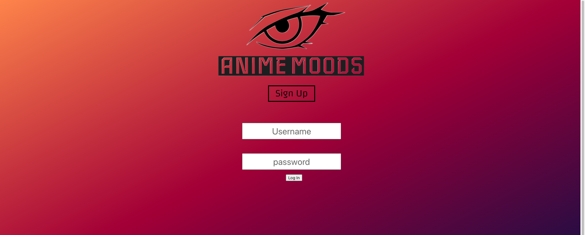
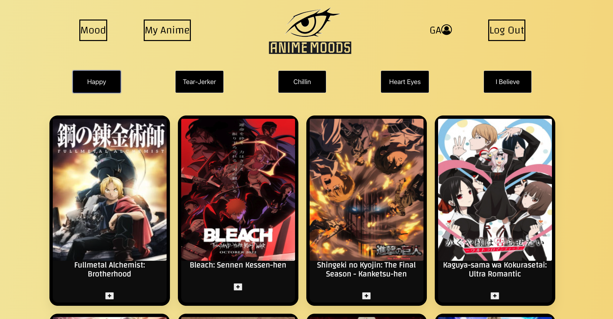
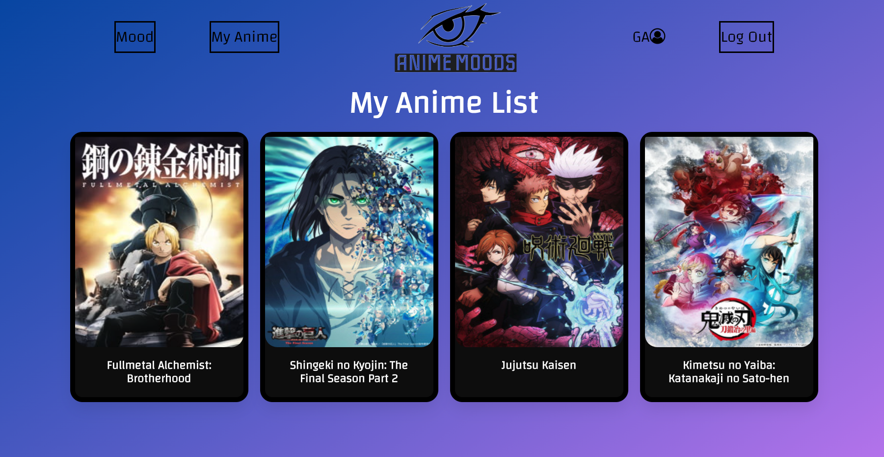

 

 
<h1 align="center">Anime Moods</h1>

  <h3 align="center">

    Find an Anime to Suit Your Mood!
 
    

 

### Description

Anime Moods helps you find the perfect anime to watch based on your current mood. Just select a mood and scroll to find an anime you'd like to watch! 

## Getting Started

To get started sign up and create your own account on or log in.
 

 

Select a mood and start browsing for an anime to watch.

 

You can add an anime to your watch list by clicking the add button.

 

## Next Steps
 

*  Comments/Likes on animes
*  Anime description page
*  Suggestion on where to watch

 

## Built By
* [LaraLBL](https://github.com/LaraLBL)
* [Nichan7](https://github.com/Nichan7)
* [DianaDPC](https://github.com/DianaDPC)

## Built With
 

(<a href="#readme-top">back to top</a>)

